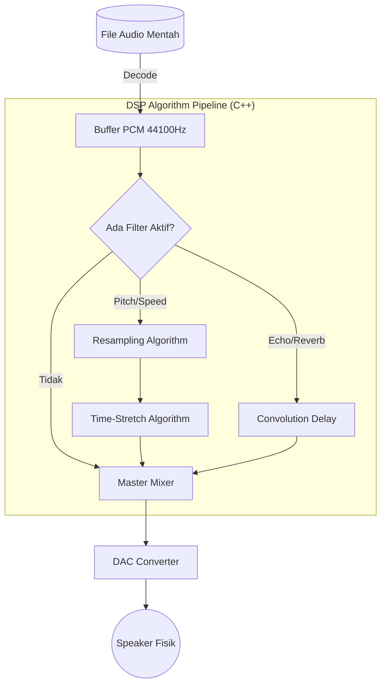

# DSP Engine Architecture (The Tech Flex)

Dokumen ini khusus dibuat sebagai bahan referensi *Tech Flexing* (Pamer Teknologi) untuk audiens *Software Engineer* di platform X/Twitter atau LinkedIn.

Fokus dokumen ini adalah membedah bagaimana aplikasi **AuraVoice** memproses manipulasi audio menggunakan **SoLoud Engine (`flutter_soloud`)** tanpa jeda (*zero-latency*).

---

## 1. Apa Itu SoLoud Engine?
**SoLoud** adalah mesin audio (Audio Engine) tingkat rendah (*low-level*) berkinerja tinggi yang ditulis murni menggunakan **C++**. Engine ini awalnya dirancang untuk *game development* karena kemampuannya memproses ratusan aliran audio secara *real-time* tanpa membuat CPU bekerja berat.

Dalam konteks *Voice Changer* kita, SoLoud bertindak sebagai **DSP (Digital Signal Processor)**. 
Ketika *user* menggeser *slider Pitch* (Nada), SoLoud tidak merekam ulang suaranya. Ia menjalankan algoritma matematika untuk merapatkan atau merenggangkan jarak antar titik-titik sampel gelombang suara (Resampling & Pitch Shifting) secara *on-the-fly* sebelum dikirim ke perangkat *Speaker* fisik.

### Alur Algoritma DSP (Digital Signal Processing)

Berikut adalah algoritma bagaimana mesin C++ memanipulasi *Buffer* suara mentah menjadi efek (misal: "Monster" atau "Tupai") dalam hitungan mikrodetik:

### Penjelasan Algoritma (Step-by-Step)
Berikut adalah rincian teknis dari algoritma pemrosesan yang terjadi di dalam *pipeline* DSP:

1. **Input (Buffer PCM):** File audio sumber (`.wav` atau `.m4a`) di-*decode* dan dikonversi menjadi *PCM (Pulse-Code Modulation) Audio Buffer* mentah, umumnya beroperasi pada *sample rate* 44.100 Hz.
2. **Evaluasi Filter (Bypass Check):** Mesin mengevaluasi status parameter filter yang aktif. Jika seluruh parameter berada pada nilai *default* (misal: nilai *pitch* = 1.0, *reverb* = 0.0), maka rantai pemrosesan DSP diabaikan (*bypassed*) dan aliran data diteruskan langsung ke blok *Mixer*.
3. **Resampling Algorithm (Pitch Shifting):** Jika parameter *Pitch* dimodifikasi, algoritma akan melakukan interpolasi untuk memanipulasi rasio jarak antar sampel (*resampling*). Perapatan sampel akan menghasilkan frekuensi nada yang lebih tinggi, sedangkan perenggangan sampel akan menghasilkan frekuensi nada yang lebih rendah.
4. **Time-Stretch Algorithm (Kompensasi Durasi):** Modifikasi jarak antar sampel pada tahap *resampling* secara alamiah akan mengubah durasi total pemutaran (menciptakan efek percepatan atau perlambatan). Algoritma *Time-Stretch* diaktifkan untuk mengkompensasi hal ini dengan memanipulasi *windowing* pada gelombang suara, memastikan durasi *playback* tetap konstan meskipun terjadi pergeseran *pitch*.
5. **Convolution (Echo/Reverb):** Pemrosesan gema akustik (*spatial audio*) dilakukan dengan menduplikasi sinyal sumber, mengaplikasikan pelemahan amplitudo (*decay*), dan menjumlahkan sinyal-sinyal pantulan tersebut kembali ke *buffer* utama dengan berbagai rentang jeda waktu (*delay*) untuk mensimulasikan karakteristik ruang.
6. **Master Mixer & Output:** Seluruh *buffer* audio yang telah melalui pemrosesan efek diakumulasikan ke dalam satu saluran *output* final. Aliran data digital ini kemudian diteruskan menuju *Digital-to-Analog Converter* (DAC) pada arsitektur sistem operasi untuk ditransmisikan sebagai getaran akustik fisik melalui *Speaker*.

---

## 2. Proses Kompilasi: Apakah Terpisah atau Menyatu?
Pertanyaan paling sering muncul: *"Apakah C++ ini jalan di server terpisah atau jadi aplikasi kedua di dalam HP?"*

Jawabannya: **Mereka menjadi SATU KESATUAN BINARY MURNI.**

1. **Android:** Saat kita menjalankan `flutter build apk`, sistem akan memanggil **CMake**. CMake akan mengambil kode sumber asli C++ SoLoud, mengkompilasinya menjadi *Shared Object Library* (`.so`), dan menempelkannya (di-*link*) ke mesin Dart (Flutter) di dalam file `.apk` yang sama.
2. **iOS:** Saat menjalankan `flutter build ipa`, sistem menggunakan **CocoaPods** dan *Clang/LLVM* untuk mengkompilasi biner C++ tersebut menjadi *Framework* bawaan Apple, menjadikannya satu kesatuan dengan file `.ipa`.

Tidak ada *Localhost*, tidak ada koneksi API lokal, tidak ada aplikasi bayangan. Semuanya dibungkus rapat ke dalam satu paket.

---

## 3. Sandbox dan Komunikasi (The FFI Magic)
Meskipun mereka berada di dalam satu "Gedung" (Satu Aplikasi), saat aplikasi dijalankan (*runtime*), **mereka hidup di dua "Ruang Memori" yang berbeda**.

*   **Dart (Flutter):** Menggunakan *Garbage Collector* (GC) untuk mengatur memori secara otomatis.
*   **C++ (SoLoud):** Mengatur memori secara manual menggunakan alokasi `malloc` dan `free`.

### Bagaimana mereka berkomunikasi?
Jika kita menggunakan metode kuno (seperti `MethodChannel` milik Flutter standar), komunikasi akan terjadi secara **Asynchronous** (mengantre pesan melalui OS). Untuk audio, *delay* 15 milidetik saja sudah merusak pengalaman.

**Solusinya: Dart FFI (Foreign Function Interface)**
Aplikasi ini membuang *MethodChannel* dan murni menggunakan **FFI**. 
FFI adalah teknik "Akses Memori Langsung". FFI memungkinkan lapisan Dart untuk mengetahui di mana persisnya letak *pointer memori* C++ tersebut di dalam RAM.

**Alur Eksekusi:*
1. User menggeser *Slider Pitch* di UI Flutter (Dart).
2. Dart langsung menusuk ruang memori C++ dan menimpa *pointer float* nilai Pitch (misal dari `1.0` ke `2.5`).
3. C++ SoLoud yang sedang sibuk memutar audio ke Speaker langsung membaca perubahan memori tersebut di *Audio Thread* terpisah, dan seketika (*zero-latency*) mengubah nada suara.

Proses penulisan memori ini bersifat **Synchronous** (Instan), mengeliminasi *overhead* sistem operasi secara total.

---

## 4. Kesimpulan untuk "Tech Flexing"
AuraVoice bukan sekadar *"Flutter manggil library orang"*. Aplikasi ini adalah demonstrasi bagaimana antarmuka UI *cross-platform* (Dart) bisa melakukan **Direct Memory Manipulation** terhadap biner Native C++ untuk mencapai pemrosesan sinyal digital (DSP) secepat aplikasi *Native* (Swift/Kotlin), namun dengan fleksibilitas UI dari Flutter.
