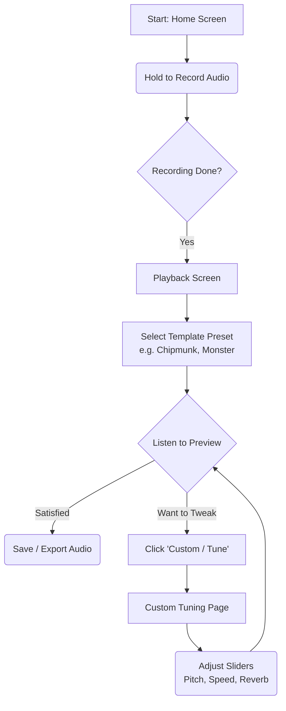

# Product Requirements Document (PRD): AuraVoice (Voice Changer)

## 1. Pendahuluan
### 1.1 Tujuan Produk (GET ATTENTION)
Tujuan utama aplikasi ini **bukanlah** sekadar alat pengubah suara biasa, melainkan sebagai **Pabrik Konten (Content Factory)** dan **Showcase Portofolio Tingkat Tinggi**.
1.  **TikTok/Reels (Komedik & Visual):** Menghasilkan *output* konten suara *absurd* (tupai, monster, alien) dengan *user interface* yang dirancang *over-engineered*. Tampilan akan dibuat seolah-olah pengguna sedang mengoperasikan mesin *hacker* audio *high-tech* demi memancing rasa penasaran penonton.
2.  **X/Twitter (Tech Flexing):** Menjadi bahan *thread* edukasi arsitektur perangkat lunak. Aplikasi ini adalah alat untuk memamerkan integrasi tingkat rendah (*Dart FFI, C++ SoLoud Engine, Digital Signal Processing, Zero-Latency Architecture*), memancing interaksi (*engagement*) dan diskusi dari sesama *Software Engineer*.

### 1.2 Target Pengguna (Audience Konten)
*   *Followers* di TikTok yang menyukai konten komedi dan visual aplikasi yang "terlihat rumit tapi lucu".
*   *Tech-Enthusiast* dan *Developer* di ekosistem X (Twitter) yang lapar akan bedah teknologi *Cross-Platform* x *Native C++*.
*   Perekrut (sebagai portofolio *engineering* yang solid).

## 2. Fitur Utama (Core Features)

### 2.1 One-Tap Audio Recording
Pengguna menekan dan menahan tombol untuk merekam suara (maksimal durasi 60 detik) yang akan langsung diproses dan disimpan di memori sementara.

### 2.2 Template Presets
Setelah rekaman selesai, pengguna dihadapkan pada antarmuka *Playback* dengan deretan tombol Template. Jika tombol ditekan, suara akan langsung dimodifikasi:
*   **🐿 Chipmunk (Tupai):** Suara kecil melengking dan cepat.
*   **👹 Monster:** Suara sangat nge-bass, berat, dan sedikit bergema.
*   **🤖 Robot:** Suara normal namun memiliki distorsi flanger/logam.
*   **🦇 Gua Hantu:** Suara yang dipenuhi *Reverb* dan *Echo* yang memantul di ruangan besar.

### 2.3 Custom Tuning (Voice Modulator)
Pengguna dapat masuk ke halaman *Tuner* di mana deretan *slider* akan memuat posisi (nilai parameter) sesuai dengan *template* yang terakhir aktif. Pengguna bisa melakukan *tweak* pada:
*   **Pitch (Nada)**
*   **Speed (Kecepatan)**
*   **Reverb (Gema)**
*   **Echo (Pantulan)**

### 2.4 User Flow

## 3. Batasan Minimum Viable Product (MVP)
Untuk mempercepat rilis v1.0 dan membuktikan kehandalan C++ FFI Audio Engine di Flutter, MVP akan dibatasi secara ketat pada fitur esensial berikut beserta alasannya:

*   **Audio Source Terbatas (Merekam Langsung):** MVP hanya mendukung sumber audio dari hasil rekaman mikrofon langsung (durasi dibatasi 60 detik). 
    *   *Alasan Kuat:* Menghindari kompleksitas perizinan *file system* OS dan *handling* format audio yang bervariasi jika pengguna mengunggah file mp3/wav dari luar aplikasi.
*   **Tidak Ada Fitur Live-Monitoring:** Suara hanya bisa dimodifikasi *setelah* rekaman selesai (*Post-Recording Playback*). 
    *   *Alasan Kuat:* Memproses efek DSP dan menembakkannya kembali ke *earphone/speaker* di saat yang bersamaan dengan mikrofon aktif membutuhkan *audio routing* tingkat rendah yang sangat rentan menyebabkan *feedback loop/storing* (suara dengung melengking), terutama di ekosistem Android yang *hardware*-nya terfragmentasi.
*   **Template Terbatas (4 Pilihan):** MVP dibatasi pada 4 template utama (Tupai, Monster, Robot, Gua Hantu). 
    *   *Alasan Kuat:* Empat template ini sudah cukup untuk mendemonstrasikan kapabilitas `SoLoud` tanpa *over-engineering* UI.
*   **Cinematic Audio Gimmick (Fake Visualizer):** Di layar *Tuner*, akan ada animasi gelombang suara atau *level meter* bergaya *hacker* yang menyala terang.
    *   *Alasan Kuat (GET ATTENTION):* Karena tujuan utama adalah *gimmick* konten TikTok, layar harus terlihat "sibuk", rumit, dan keren di kamera. Visualizer ini *tidak perlu* sinkron 100% dengan FFT C++ yang berat, melainkan cukup *fake animation* berulang yang reaktif terhadap input suara.
