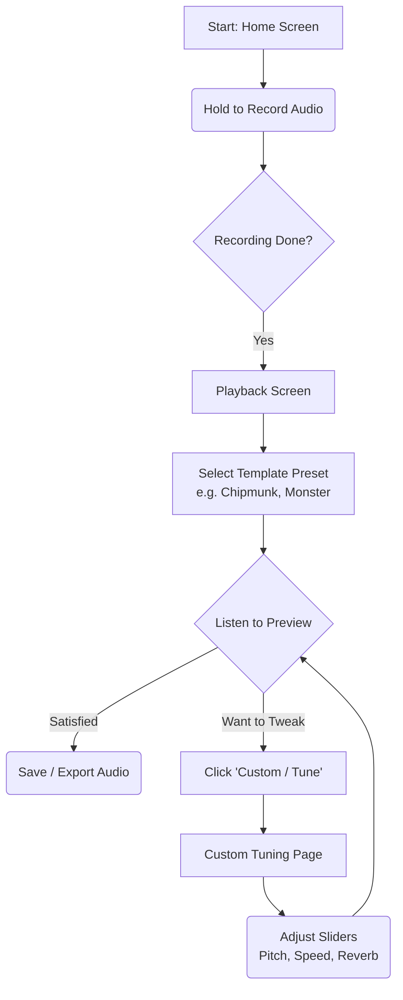

# Product Requirements Document (PRD): AuraVoice (Voice Changer)

## 1. Pendahuluan
### 1.1 Tujuan Produk
Membangun aplikasi *mobile cross-platform* (iOS & Android) untuk memanipulasi suara rekaman pengguna secara *real-time* menggunakan efek audio DSP. Aplikasi ini menonjolkan fitur *template preset* yang lucu dan halaman *Custom Tuning* yang responsif.

### 1.2 Target Pengguna
*   Pengguna kasual yang ingin bereksperimen dengan suara mereka untuk hiburan/lelucon.
*   Konten Kreator atau pembuat *meme* yang membutuhkan modifikasi suara unik namun praktis tanpa perlu paham teknik *audio engineering*.

## 2. Fitur Utama (Core Features)

### 2.1 One-Tap Audio Recording
Pengguna menekan dan menahan tombol untuk merekam suara (maksimal durasi 60 detik) yang akan langsung diproses dan disimpan di memori sementara.

### 2.2 Template Presets
Setelah rekaman selesai, pengguna dihadapkan pada antarmuka *Playback* dengan deretan tombol Template. Jika tombol ditekan, suara akan langsung dimodifikasi:
*   **🐿 Chipmunk (Tupai):** Suara kecil melengking dan cepat.
*   **👹 Monster:** Suara sangat nge-bass, berat, dan sedikit bergema.
*   **🤖 Robot:** Suara normal namun memiliki distorsi flanger/logam.
*   **🦇 Gua Hantu:** Suara yang dipenuhi *Reverb* dan *Echo* yang memantul di ruangan besar.

### 2.3 Custom Tuning (Voice Modulator)
Pengguna dapat masuk ke halaman *Tuner* di mana deretan *slider* akan memuat posisi (nilai parameter) sesuai dengan *template* yang terakhir aktif. Pengguna bisa melakukan *tweak* pada:
*   **Pitch (Nada)**
*   **Speed (Kecepatan)**
*   **Reverb (Gema)**
*   **Echo (Pantulan)**

### 2.4 User Flow

## 3. Batasan Minimum Viable Product (MVP)
Untuk mempercepat rilis v1.0 dan membuktikan kehandalan C++ FFI Audio Engine di Flutter, MVP akan dibatasi secara ketat pada fitur esensial berikut beserta alasannya:

*   **Audio Source Terbatas (Merekam Langsung):** MVP hanya mendukung sumber audio dari hasil rekaman mikrofon langsung (durasi dibatasi 60 detik). 
    *   *Alasan Kuat:* Menghindari kompleksitas perizinan *file system* OS dan *handling* format audio yang bervariasi jika pengguna mengunggah file mp3/wav dari luar aplikasi.
*   **Tidak Ada Fitur Live-Monitoring:** Suara hanya bisa dimodifikasi *setelah* rekaman selesai (*Post-Recording Playback*). 
    *   *Alasan Kuat:* Memproses efek DSP dan menembakkannya kembali ke *earphone/speaker* di saat yang bersamaan dengan mikrofon aktif membutuhkan *audio routing* tingkat rendah yang sangat rentan menyebabkan *feedback loop/storing* (suara dengung melengking), terutama di ekosistem Android yang *hardware*-nya terfragmentasi.
*   **Template Terbatas (4 Pilihan):** MVP dibatasi pada 4 template utama (Tupai, Monster, Robot, Gua Hantu). 
    *   *Alasan Kuat:* Empat template ini sudah lebih dari cukup untuk mendemonstrasikan kapabilitas seluruh parameter utama `SoLoud` (*Pitch, Speed, Reverb, Flanger*) dan membuktikan *state management* berjalan dengan baik tanpa *over-engineering* tampilan UI.
*   **Tanpa Audio Visualizer Real-time:** Tidak menampilkan gelombang suara yang bergerak dinamis saat pemutaran efek. 
    *   *Alasan Kuat:* Merender *visualizer* membutuhkan ekstraksi *FFT (Fast Fourier Transform)* dari biner C++ ke 60fps *Flutter UI*. Ini memakan daya dan menjauhkan prioritas utama MVP: "Stabilitas Mesin Suara Tanpa *Lag*".
