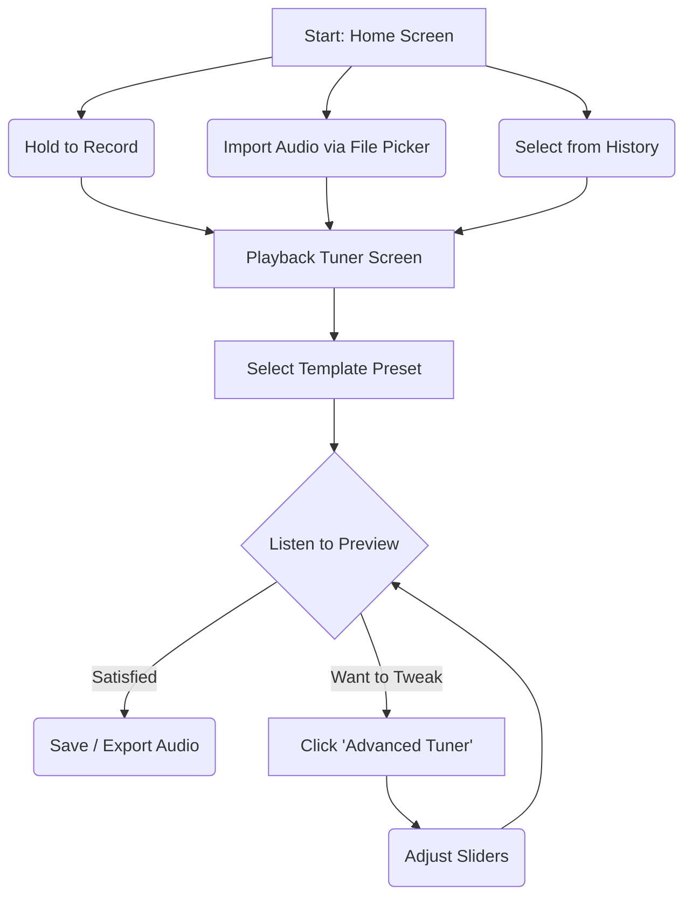

# Product Requirements Document (PRD): AuraVoice (Voice Changer)

## 1. Introduction
### 1.1 Product Goal (The "Flex")
The primary goal of AuraVoice is **not** just to be another voice-changing app. It is designed as a **Content Factory** and a **High-Tier Portfolio Showcase** targeting the US tech market.
1. **X (Twitter) & Indie Hackers (Tech Flexing):** The app serves as a prime example of building high-performance, over-engineered software architecture. It demonstrates low-level integration (*Dart FFI, C++ SoLoud Engine, Digital Signal Processing, Zero-Latency Architecture*) and Strict Clean Architecture to attract engagement and discussion from top-tier US Software Engineers and Startup Founders.
2. **US Startup Market (Aesthetics & UX):** The UI is designed with a sleek, premium, Apple-esque aesthetic (Dark Mode `#0D0D0E`, Glassmorphism, subtle gradients). It proves that Flutter can deliver beautiful, native-feeling experiences without compromising on rendering performance.

### 1.2 Target Audience
* **Startup Founders & Recruiters in the US** looking for robust software engineering portfolios.
* **Tech-Enthusiasts and Developers** on X (Twitter) hungry for cross-platform and Native C++ integration deep-dives.

## 2. Core Features

### 2.1 One-Tap Audio Recording
Users can hold the sleek microphone button to record audio (up to 60 seconds), which is instantly processed and saved to the app's document directory.

### 2.2 Audio Import (File Picker)
Users can import existing audio files (`.m4a`, `.mp3`, `.wav`) directly from their device storage using the native OS file picker.

### 2.3 Recording History
The home screen features a glassmorphic bottom sheet that persistently displays the history of all recorded and imported audio files, allowing users to jump straight into modifying past recordings.

### 2.4 Template Presets & Playback
When a recording is finished or selected from history, users enter the *Playback Tuner*. Tapping a template instantly modifies the sound via zero-latency C++ FFI:
* **Normal:** Raw audio.
* **Chipmunk:** Fast, high-pitched.
* **Monster:** Deep, heavy bass.

### 2.5 Advanced Tuner
Users can enter the *Advanced Tuner* page to manually tweak the parameters that were set by the templates:
* **Pitch Shift**
* **Speed (Playback Rate)**

### 2.6 User Flow

```mermaid
graph TD
    A[Start: Home Screen]
    A --> B(Hold to Record)
    A --> C(Import Audio via File Picker)
    A --> D(Select from History)
    
    B --> E[Playback Tuner Screen]
    C --> E
    D --> E
    
    E --> F[Select Template Preset]
    F --> G{Listen to Preview}
    G -- Satisfied --> H(Save / Export Audio)
    G -- Want to Tweak --> I[Click 'Advanced Tuner']
    I --> J(Adjust Sliders)
    J --> G
```

## 3. Minimum Viable Product (MVP) Boundaries
To rapidly deploy v1.0 and prove the reliability of the C++ FFI Audio Engine and Clean Architecture in Flutter, the MVP is strictly bound to the following features:

* **No Live-Monitoring:** Audio modification happens *after* recording/importing (*Post-Recording Playback*). 
    * *Reason:* Processing DSP effects and routing them back to the speaker simultaneously with an active microphone requires low-level audio routing that is highly prone to feedback loops, especially on fragmented Android hardware.
* **Template Limits:** MVP is limited to core templates (Normal, Chipmunk, Monster) to demonstrate `SoLoud` capabilities cleanly.
* **Simulated Export:** Currently, the export button simulates the rendering process. True audio re-encoding requires `ffmpeg_kit_flutter`, which is deferred to v2 to maintain stable iOS build configurations.
* **Off-Main-Thread Processing:** The visualizer rendering and file I/O operations are offloaded to Dart Isolates / asynchronous background tasks to ensure the main UI thread never drops below 60/120fps.
