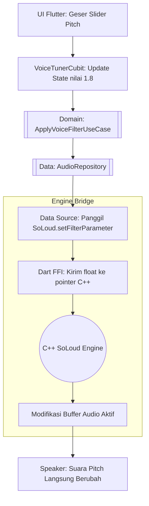
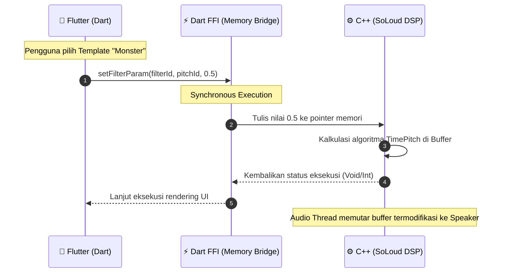

# Technical Requirements Document (TRD): AuraVoice (Clean Architecture Edition)

## 1. Arsitektur Sistem (Clean Architecture & FFI Bridge)
Sistem ini menggunakan standar industri **Clean Architecture** (Presentation, Domain, Data) yang dikombinasikan dengan arsitektur **Foreign Function Interface (FFI)** untuk komunikasi tingkat rendah (*low-level*) dengan C++ Audio Engine.

Tujuannya agar modul Tampilan (Flutter UI) dan Otak Pemroses (Matematika DSP / *Digital Signal Processing*) bekerja sebagai entitas terpisah, namun dapat saling mengirimkan data parameter suara dengan latensi mendekati nol (*zero-latency*).

## 2. Tech Stack (Spesifikasi Teknologi)
Berikut adalah daftar lengkap teknologi yang digunakan beserta alasan penggunaannya:

### 2.1 Flutter / Dart (Lapisan Antarmuka & Logika Bisnis)
*   **Flutter & Dart:** Digunakan untuk merancang UI pengontrol *slider* dan *template* yang interaktif.
*   **Clean Architecture:** Memisahkan kode menjadi lapisan `Presentation`, `Domain`, dan `Data` agar mudah dirawat dan diuji.
*   **BLoC / Cubit (`flutter_bloc`):** *State Management* utama. Mengatur status layar (*Recording* ➡️ *Playback* ➡️ *Tuning*).
*   **Dependency Injection (`get_it`):** Kontainer sentral agar *UseCase*, *Repository*, dan *Cubit* tersambung secara otomatis dan *loosely coupled*.
*   **Audio Recording (`record` / `audio_waveforms`):** Pustaka untuk menangkap data suara mentah dari mikrofon OS dan menyimpannya ke memori sementara.

### 2.2 Audio Engine (Lapisan DSP & Kecerdasan Pemrosesan)
*   **C++ (SoLoud Engine):** *Engine* audio *open-source* berkinerja tinggi yang memproses manipulasi gelombang audio (DSP) murni secara lokal di dalam memori perangkat.
*   **Dart FFI (Foreign Function Interface):** Penghubung sinkron antara Dart dan biner C++. Berbeda dengan *MethodChannel* yang mengantre pesan (*asynchronous*), FFI mengizinkan Dart memanipulasi *pointer* memori C++ secara seketika (*synchronous*), sangat krusial untuk *audio real-time*.
*   **`flutter_soloud`:** *Package* Flutter yang membungkus *SoLoud engine* dan mengekspos filter audio (*Pitch Shift*, *Time Stretch*, *Echo*) langsung ke lapisan Dart.

## 3. Pembagian Layer (Clean Architecture)

### 3.1 Data Layer (Penanganan C++ Engine)
Di sinilah letak perbatasan antara Dart dan lapisan C++.
*   **Audio Data Source (`AudioNativeDataSource`):** Bertanggung jawab memanggil *method* dari `flutter_soloud`. Fungsi utamanya adalah melakukan *load* file rekaman, menjalankan audio, dan menempelkan ID Filter (*Pitch*, *Reverb*) ke proses *playback*.
*   **Repository Implementation (`AudioRepositoryImpl`):** Menerjemahkan kebutuhan *Domain* (seperti merubah nilai *slider* 0.5) menjadi perintah *Data Source* yang spesifik.

### 3.2 Domain Layer (Core Business Rules)
*   **Entity (`AudioFilterEntity`):** Data kelas murni berisi konfigurasi *template* atau nilai saat ini dari slider (contoh: `pitch: 1.5, reverb: 0.2`).
*   **Use Case (`ApplyVoiceFilterUseCase`):** Fungsi spesifik yang meminta *Repository* untuk mengeksekusi perubahan suara saat *user* berinteraksi dengan antarmuka.

### 3.3 Presentation Layer (UI & State)
*   **BLoC/Cubit (`VoiceTunerCubit`):** Mengelola State (menyimpan angka *slider* saat ini dan *template* yang aktif).
*   **UI (Screens):** Murni menempel ke *state* Cubit. Saat pengguna menggeser slider, UI langsung mengirim nilai baru ke Cubit ➡️ UseCase ➡️ Engine.

## 4. Flowchart Sistem

### 4.1 Flowchart Interaksi UI ke Audio Engine
Bagian ini menggambarkan perjalanan data seketika (*real-time*) saat pengguna menggeser parameter *tuning*.



### 4.2 Sequence Diagram Anatomi Komunikasi FFI (Dart ke C++)
Bagian ini membuktikan kenapa kita menggunakan **FFI** alih-alih *MethodChannel* untuk pemrosesan Audio. FFI mengizinkan akses ke ruang memori secara langsung dan instan.



## 5. Struktur Direktori Proyek
*(Struktur ditekankan pada pemisahan layer Clean Architecture)*

```text
VoiceChanger/
│
├── lib/
│   ├── injection.dart                # Dependency Injection (Setup GetIt)
│   ├── main.dart
│   │
│   ├── data/
│   │   ├── datasources/audio_native_datasource.dart # (FFI/SoLoud Caller)
│   │   └── repositories/audio_repository_impl.dart
│   │
│   ├── domain/
│   │   ├── entities/audio_filter_entity.dart
│   │   ├── repositories/i_audio_repository.dart
│   │   └── usecases/apply_voice_filter_usecase.dart
│   │
│   └── presentation/
│       ├── bloc/voice_tuner_cubit.dart
│       ├── pages/home_record_page.dart
│       ├── pages/playback_template_page.dart
│       ├── pages/custom_tuner_page.dart
│       └── widgets/sliders/
│
├── PRD.md              
├── TRD.md              
├── MVP.md              
└── README.md
```
