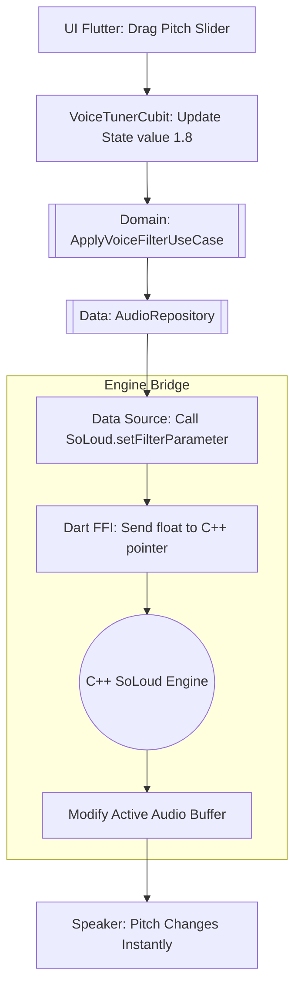
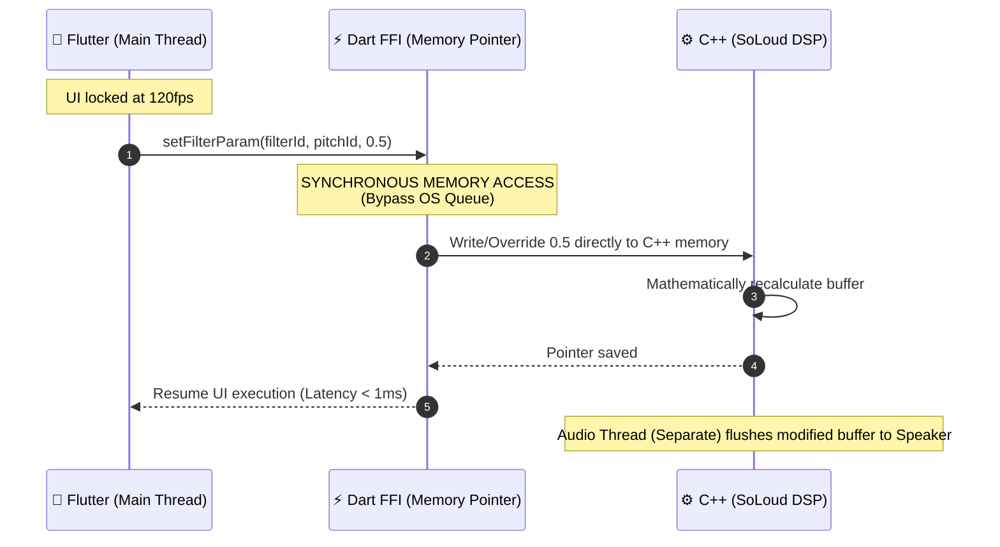

# Technical Requirements Document (TRD): AuraVoice (Clean Architecture Edition)

## 1. System Architecture (The Zero-Latency Flex)
This system ditches the traditional *MethodChannel* approach (which is slow and asynchronous) and replaces it with a **Direct Memory Access (DMA)** simulation via **Synchronous Foreign Function Interface (FFI)**. 

The goal? **Tech Flexing for the US Market**. This architecture proves that Flutter UI and C++ (DSP) can manipulate memory pointers in real-time, resulting in sound wave modifications (*Pitch/Tempo*) with zero latency. Furthermore, the architecture cleanly separates heavy audio operations and cosmetic processes using **Isolate-driven UI** so the screen maintains buttery smooth 120fps scrolling.

## 2. Tech Stack 
Here is the complete list of technologies used and the rationale behind them:

### 2.1 Flutter / Dart (Presentation & Business Logic Layer)
*   **Flutter & Dart:** Used to design a sleek, premium, Apple-esque UI/UX targeted at US startup founders and Indie Hackers.
*   **Clean Architecture (SOLID):** Strict separation into `Presentation`, `Domain`, and `Data` layers. Even UI-driven features like File Picking and local file history are abstracted via `UseCases`.
*   **Isolate (Dart Concurrency):** Runs heavy visualizer calculations outside the *Main Thread*.
*   **BLoC / Cubit (`flutter_bloc`):** Reactive State Management responding instantly to slider shifts.
*   **Dependency Injection (`get_it`):** Central container for automatic injection of Repositories and UseCases.
*   **Audio Recording (`record`):** Captures raw audio buffers from the OS microphone.
*   **File Picker (`file_picker` v11+):** Native OS integration for importing external `.m4a`/`.mp3` files securely.
*   **Platform Permissions (`permission_handler`):** Handles OS security layers for microphone access.

### 2.2 Audio Engine (DSP Layer)
*   **C++ (SoLoud Engine):** High-performance open-source audio engine processing DSP manipulation entirely locally.
*   **Dart FFI (Foreign Function Interface):** Synchronous bridge between Dart and C++ binaries.
*   **`flutter_soloud`:** Flutter package wrapping the SoLoud engine, exposing audio filters directly to Dart.

## 3. Clean Architecture Layer Breakdown

### 3.1 Data Layer (External Systems & C++ Engine)
Where Dart meets C++ and external device hardware/file systems.
*   **Audio Data Source (`AudioNativeDataSource`):** Responsible for calling `flutter_soloud`, handling `file_picker` hardware calls, and reading the local OS application directory to fetch recording history.
*   **Repository Implementation (`AudioRepositoryImpl`):** Translates Domain requirements into specific Data Source executions.

### 3.2 Domain Layer (Core Business Rules)
*   **Entity (`AudioFilterEntity`):** Pure data class containing template configurations or current slider values.
*   **Use Cases:** Orchestrators for specific actions.
    *   `ApplyVoiceFilterUseCase`
    *   `GetAudioHistoryUseCase` (Fetches historical recordings via Data Source)
    *   `PickExternalAudioUseCase` (Handles file importing securely)

### 3.3 Presentation Layer (UI & State)
*   **BLoC/Cubit (`VoiceTunerCubit` & `AuraVoiceCubit`):** Manages State. They do **not** know about `dart:io` or `file_picker`. They strictly rely on injected UseCases.
*   **UI (Screens):** Glassmorphic, dark-mode screens. Directly bind to Cubit state.

## 4. System Flowcharts

### 4.1 UI to Audio Engine Interaction
This demonstrates the real-time data journey when a user drags a tuning parameter.


```mermaid
graph TD
    A[UI Flutter: Drag Pitch Slider] --> B[VoiceTunerCubit: Update State value 1.8]
    B --> C[[Domain: ApplyVoiceFilterUseCase]]
    C --> D[[Data: AudioRepository]]
    D --> E[Data Source: Call SoLoud.setFilterParameter]
    
    subgraph Engine Bridge
    E --> F[Dart FFI: Send float to C++ pointer]
    F --> G((C++ SoLoud Engine))
    G --> H[Modify Active Audio Buffer]
    end
    
    H --> I[Speaker: Pitch Changes Instantly]
```

### 4.2 FFI Communication Anatomy (Why MethodChannels Fail Audio)
This is the primary argument for *Tech Flexing*. FFI bypasses the OS queue, allowing Dart to pierce C++ memory synchronously.


```mermaid
sequenceDiagram
    autonumber
    participant UI as 💙 Flutter (Main Thread)
    participant FFI as ⚡ Dart FFI (Memory Pointer)
    participant CPP as ⚙️ C++ (SoLoud DSP)

    Note over UI: UI locked at 120fps
    UI->>FFI: setFilterParam(filterId, pitchId, 0.5)
    
    Note over FFI: SYNCHRONOUS MEMORY ACCESS <br> (Bypass OS Queue)
    FFI->>CPP: Write/Override 0.5 directly to C++ memory
    CPP->>CPP: Mathematically recalculate buffer
    CPP-->>FFI: Pointer saved
    
    FFI-->>UI: Resume UI execution (Latency < 1ms)
    Note over CPP: Audio Thread (Separate) flushes modified buffer to Speaker
```

## 5. Project Directory Structure
*(Structured with strict adherence to Clean Architecture separation)*

```text
VoiceChanger/
│
├── lib/
│   ├── injection.dart                # Dependency Injection (GetIt Setup)
│   ├── main.dart
│   │
│   ├── data/
│   │   ├── datasources/audio_native_datasource.dart # (FFI/File System/Picker caller)
│   │   └── repositories/audio_repository_impl.dart
│   │
│   ├── domain/
│   │   ├── entities/audio_filter_entity.dart
│   │   ├── repositories/i_audio_repository.dart
│   │   └── usecases/
│   │       ├── apply_voice_filter_usecase.dart
│   │       ├── get_audio_history_usecase.dart
│   │       └── pick_external_audio_usecase.dart
│   │
│   └── presentation/
│       ├── bloc/
│       │   ├── aura_voice_cubit.dart
│       │   └── voice_tuner_cubit.dart
│       ├── pages/
│       │   ├── home_record_page.dart
│       │   ├── playback_template_page.dart
│       │   └── custom_tuner_page.dart
│       └── widgets/
│
├── PRD.md              
├── TRD.md              
├── EXECUTION_PLAN.md              
└── README.md
```
